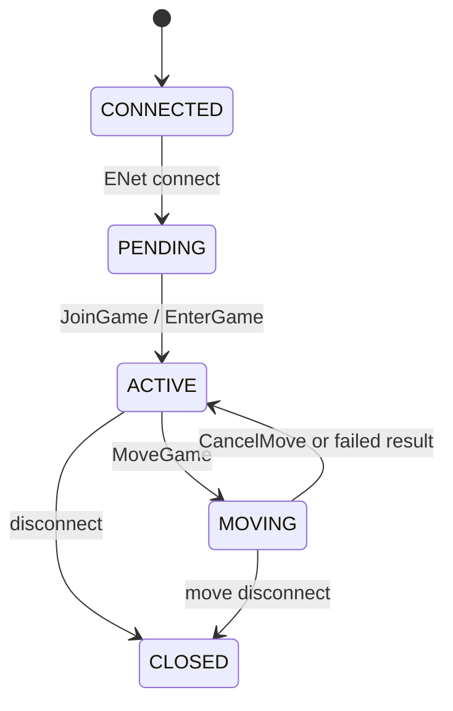

# XYSKY UDP

English | [中文](README_zh.md)

XYSKY UDP is a multiplayer room server implementing the current protocol used by *Sky: Children of the Light*. It is written in Node.js, uses ENet for reliable UDP game traffic, and exposes read-only HTTP status endpoints and Prometheus metrics.

## Requirements

- Node.js 20 or newer
- npm
- An available UDP port

Check the installed versions:

```powershell
node -v
npm -v
```

## Installation And Startup

```powershell
npm install
npm start
```

Default listeners:

```text
ENet UDP: 0.0.0.0:19132
HTTP TCP: 0.0.0.0:19132
```

TCP and UDP can use the same port number.

## Configuration

Configuration is read directly from the process environment. The project does not load `.env` files automatically.

| Variable | Default | Description |
| --- | --- | --- |
| `NODE_ENV` | `development` | `development`, `test`, or `production` |
| `LOG_LEVEL` | `info` | Pino log level; use `debug` for protocol diagnostics |
| `LOG_PRETTY` | `false` | Enables readable logs; enabled automatically in development |
| `ROOM_HOST` | `0.0.0.0` | ENet UDP listen address |
| `ROOM_PORT` | `19132` | ENet UDP port |
| `ROOM_PUBLIC_URI` | `127.0.0.1:19132` | Public UDP endpoint reported to qwd and returned to clients; never use the bind address here |
| `ROOM_MAX_PEERS` | `64` | ENet connection slots; joined players are still limited to 8 |
| `ROOM_CHANNELS` | `2` | Number of ENet channels |
| `ROOM_TICK_RATE` | `10` | Synchronization ticks per second |
| `ROOM_MAX_PACKET_BYTES` | `16384` | Maximum client packet size |
| `ROOM_BAD_PACKET_LIMIT` | `8` | Closes a session after this many malformed packets |
| `HTTP_HOST` | `0.0.0.0` | HTTP listen address |
| `HTTP_PORT` | `19132` | HTTP TCP port |
| `MOVE_TARGETS` | `[]` | JSON array of migration target rooms |

## Connection State Machine



## License

This project is licensed under the [GNU Affero General Public License v3.0](LICENSE).
