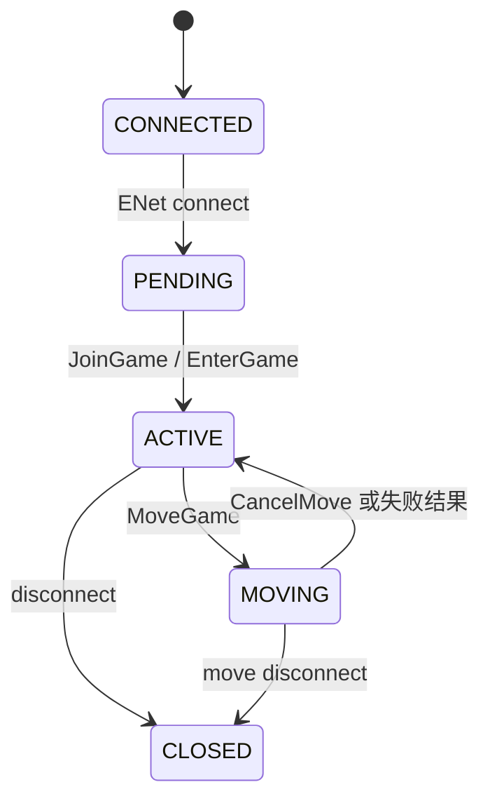

# XYSKY UDP

[English](README.md) | 中文

XYSKY UDP is a server implementation of the protocol used by version 34.5 of the Sky: Children of the Light client.
  The project is written in Node.js.

## 环境要求

- Node.js 20 或更高版本
- npm
- 可用的 UDP 端口

确认版本：

```powershell
node -v
npm -v
```

## 安装与启动

```powershell
npm install
npm start
```

默认监听：

```text
ENet UDP: 0.0.0.0:19132
HTTP TCP: 0.0.0.0:19132
```

TCP 和 UDP 可以使用相同端口号。

## 配置

配置直接从进程环境变量读取，项目不会自动加载 `.env` 文件。

| 环境变量 | 默认值 | 说明 |
| --- | --- | --- |
| `NODE_ENV` | `development` | `development`、`test` 或 `production` |
| `LOG_LEVEL` | `info` | Pino 日志级别；协议排错建议使用 `debug` |
| `LOG_PRETTY` | `false` | 是否启用可读日志；开发环境会自动启用 |
| `ROOM_ID` | `main` | 当前房间标识 |
| `ROOM_HOST` | `0.0.0.0` | ENet UDP 监听地址 |
| `ROOM_PORT` | `19132` | ENet UDP 端口 |
| `ROOM_MAX_PEERS` | `64` | ENet 连接槽数量；已加入玩家仍限制为 8 |
| `ROOM_CHANNELS` | `2` | ENet channel 数量 |
| `ROOM_TICK_RATE` | `10` | 每秒同步 tick 数 |
| `ROOM_MAX_PACKET_BYTES` | `16384` | 最大客户端数据包字节数 |
| `ROOM_BAD_PACKET_LIMIT` | `8` | 单连接坏包达到该次数后关闭会话 |
| `HTTP_HOST` | `0.0.0.0` | HTTP 监听地址 |
| `HTTP_PORT` | `19132` | HTTP TCP 端口 |
| `MOVE_TARGETS` | `[]` | 可迁移目标房间 JSON 数组 |

## 连接状态机



## 许可证

本项目使用 [GNU Affero General Public License v3.0](LICENSE)。
